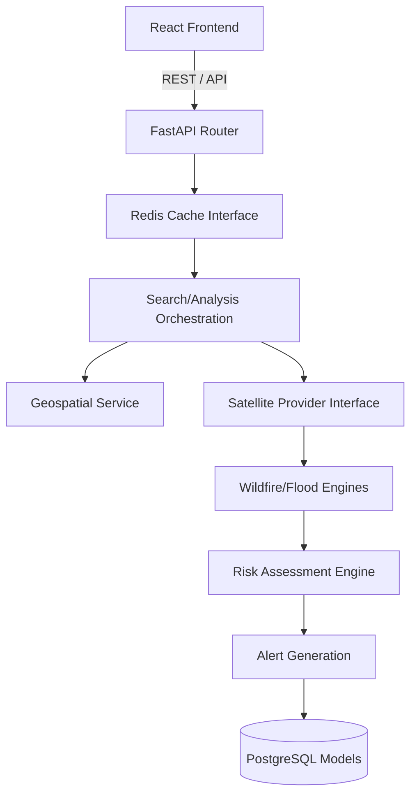

# Architecture Overview

## Structural Diagram

## Layers
1. **Frontend (Presentation)**: Built on React 18, Vite, and TailwindCSS. Uses `axios` for strict, typed communications with backend services. Focuses on spatial rendering using Leaflet.
2. **Gateway (API)**: FastAPI REST application exposing explicit bounds and validation using PyDantic `SearchRequest` and `AnalysisResult` configurations.
3. **Services (Business Logic)**:
    - `AnalysisService`: The brain coordinating providers, engines, and risk scoring.
    - `GeospatialService`: Coordinates parsing and mapping.
    - `AlertService`: Generates categorized alert matrices.
4. **Data Access (Repositories)**: SQLAlchemy 2.0 implementations completely abstracting raw SQL away from service layers.
5. **Observability**: A standalone metric and health aggregator running independently of the core processing loops, preventing system stalls during reporting.
