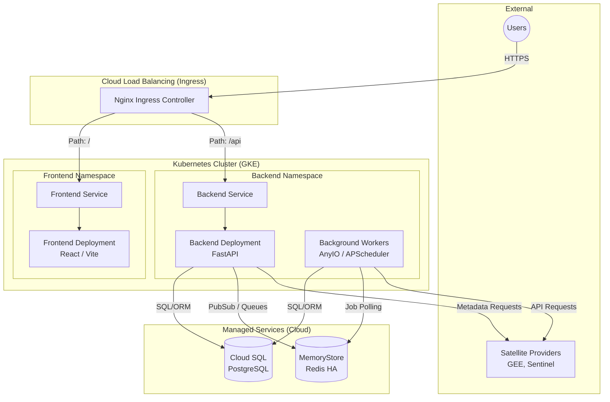

# Aegis Earth Architecture Topology

This document visualizes the infrastructure and deployment topography of the Aegis Earth platform.

## Infrastructure Flow

## Scaling Dimensions
1. **Frontend**: Scales via HPA based on CPU (static asset delivery).
2. **Backend**: Scales via HPA based on CPU/HTTP connection load.
3. **Workers**: Scales horizontally consuming queue length metrics.
4. **Database**: Scaled vertically (Compute/RAM) and isolated from application clusters.
5. **Redis**: Scaled vertically, operating in High Availability mode.
